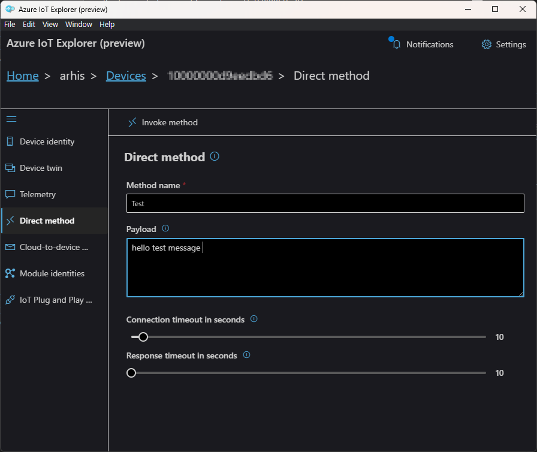

# Raspberry pi pico W5100 Azure message

1. board image

    

2. How to connect raspberry pi and raspberry pi pico.

    

3. Raspberry pi sends cert data to Raspberry pi pico using serial communication.

- Send Device ID

    

- Send key data

    

- Send Cert data

    

- serial communicaiton format

    

4. Pico Azure Connect

- Pico Log

    

- Azure IoT Explorer

    

5. Azure Telemetry receive
 - Pico Send Telemetry message

    

 - Explorer receives the message

    

 6. Pico Direct method receive
 - Explorer sends Direct method

    

 - Pico receives the direct method
 

    

